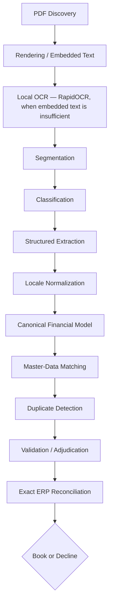

# Invoice Adjudication & ERP Validation System

*(This is the submission's own documentation. `README.md` in this repository is
the assignment brief itself and has been left untouched throughout — see
"A note on this file" at the bottom. `DESIGN.md` is the required ≤3-page
answer to the brief's three reflective questions; `ARCHITECTURE.md` is a
longer, supplementary architecture reference for anyone who wants the
detail behind the summary given here.)*

## 1. Overview

Given a supplier document as a PDF, this system decides **what the document
is** and **what, if anything, is owed**, and emits structured records (
`autodrafts`) that a downstream ERP system can book — or it declines the
document with a reason, when there isn't enough evidence to book it safely.

It is not a document-extraction tool. Extracting fields is one stage in a
longer pipeline whose real job is **adjudication**: deciding whether a
candidate payable is grounded, internally consistent, and reconcilable
against the ERP's own arithmetic before it is ever allowed to book. A record
that merely *looks like* the source document is not enough — the ERP must
independently recompute the same gross total from the raw components this
system supplies (quantities, prices, discounts, taxes, charges), to the
cent, with no tolerance.

The pipeline, end to end:

```
classify → extract → normalize → model → match → detect duplicates → validate → reconcile → book/decline
```

## 2. Key Design Principles

- **Evidence-grounded extraction.** A value only appears in the output if it
  was actually found in the document's text — a value that only "made
  arithmetic convenient" is not acceptable, and a dedicated groundedness
  check (Phase 10) verifies this against the raw OCR/embedded text.
- **Conservative decisions.** When evidence is insufficient or contradictory,
  the system declines rather than guesses. This applies to classification,
  currency, master-data codes, dates, and financial structure alike.
- **Deterministic financial computation.** All arithmetic is plain,
  reproducible Python — never delegated to an LLM, never approximated.
- **Exact ERP reconciliation.** A payable is only accepted if the supplied
  `erp.py` recomputes the *exact* same gross the document states. No
  tolerance, no rounding workaround.
- **Master-data validation without fabrication.** A master-data ID is only
  emitted if it demonstrably exists in the corresponding master file. Blank
  is a correct, honest answer when there is no reliable match.
- **Duplicate protection that isn't trigger-happy.** Only strong, specific
  evidence (an identical file, identical content, or a complete matching
  business key) triggers an automatic decline. A "Copy" label or a
  near-duplicate alone is advisory, never decisive on its own.
- **Fail-safe ambiguity handling.** An unrecognized number format, an
  unfamiliar calendar, or a genuinely ambiguous business-unit assignment all
  resolve to "unresolved" rather than to a guess.
- **No fabricated values, anywhere in the pipeline.**

## 3. Architecture



Each stage lives in its own module under `pipeline/` (see the Project
Structure section below). There is no live vision/LLM step in this
environment — every stage above runs deterministically or via the local OCR
engine described next.

## 4. OCR Approach

Roughly 88% of the corpus is scanned pages with no usable embedded PDF text
(confirmed in `STEP1_STEP2_ANALYSIS.md`). Rather than assume a text layer
exists, `pipeline/ocr_render.py` renders every page to an image and falls
back to OCR whenever the embedded text is missing or too sparse/garbled to
trust.

The OCR engine is **`rapidocr-onnxruntime`** — a fully local, pip-installable
OCR engine (ONNX Runtime + open OCR models). It requires:

- no API key,
- no paid service,
- no system-level binary install (unlike Tesseract, which needs an installer
  requiring admin rights this environment doesn't have),
- no network calls at inference time.

It runs inside a **project-local virtual environment** (`.venv/`), kept
separate from the machine's global Python environment on purpose — installing
its dependencies (`onnxruntime`, `opencv-python`, a specific `numpy` version)
globally once caused a version conflict with an unrelated project on the same
machine. See Setup below.

If `rapidocr-onnxruntime` is not installed, the system does not fail — it
falls back to `NULL_OCR_PROVIDER`, which honestly returns no text rather
than fabricating a result. This fallback is exercised directly in the test
suite.

**OCR quality varies with document layout.** A cleanly scanned page with
plain paragraph text OCRs reliably; a dense multi-column table, a rotated
page, or a low-contrast scan can produce partial or noisy text, which then
limits what the extraction stage can find. This is a real, observed limit —
not a hidden one (see Section 11, Results, and `CORPUS_EVALUATION.md`).

## 5. Extraction

`pipeline/extraction.py` is a deterministic, label/pattern-based extractor
(no LLM/vision call is made — see Section 15). Where a recognizable
label or pattern exists in the (OCR or embedded) text, it extracts:

- invoice/document number, document type signal, credit-memo indicator
- invoice date, due date (independently labeled, never guessed apart)
- currency (ISO code, or an unambiguous symbol — never inferred from
  supplier country, never guessed from an ambiguous symbol like "$")
- supplier name, buyer name (role-labeled, multilingual)
- supplier VAT/tax ID, and a country derived from its prefix
- PO number
- payment-term text
- subtotal, and header-level tax rate/amount (possibly several, kept
  distinct, never blended into one)
- the document's stated grand total

**Line-item/SKU table extraction is not implemented.** Reconstructing a
real multi-row pricing table from noisy OCR text without vision/layout
understanding was explicitly out of scope for this build; every payable
this system produces is structurally a single line item (or a
subtotal-plus-tax pair), which is honest and sufficient for header-total
documents but not for genuinely itemized multi-line invoices. This is the
single largest gap between what this system does and full invoice
automation — stated plainly, not hidden.

## 6. Locale Normalization

`pipeline/locale_normalize.py` is pure deterministic Python (no LLM
involvement) that turns printed values into the dot-decimal / ISO-date
representation the schema and `erp.py` require:

- EU (`1.234,56`), US (`1,234.56`), and no-thousands decimal formats
- negative numbers and parenthetical negatives (`(123.45)`)
- percentages, and currency-symbol/code-wrapped amounts
- several date formats, plus a general Thai Buddhist Era conversion
  (triggered by evidence — an explicit marker or an implausible Gregorian
  year — never by document identity)

A genuinely ambiguous number (e.g. `10,000` with no corroborating context)
or an unrecognized date/calendar **raises rather than guesses** — the
caller then treats that field as unresolved.

## 7. Financial Model

`pipeline/financial_model.py` builds a schema-shaped payable and validates
it against the real, unmodified `erp.py`. It supports line-level and
header-level taxes (kept separate, never blended), multiple distinct tax
rates, discounts, freight/insurance/extra charges/excise duties,
withholding (as a negative tax amount), and credit memos (sign-normalized
to positive magnitudes in exactly one place).

For a charge whose placement relative to tax is ambiguous (is it inside the
taxable base, or added after tax?), the model builds **both** candidate
structures and keeps whichever one the real `erp.py` confirms reproduces
the document's stated gross exactly — never a structure chosen because it
"looks reasonable." If neither structure (nor a third possibility — that
the charge shouldn't have been added at all) reconciles, the candidate is
explicitly irreconcilable and is declined, never forced.

## 8. Master-Data Matching

`pipeline/matching/` resolves supplier, business-unit, tax, payment-term,
and PO codes against `master_data/`, in each case preferring the strongest
available evidence:

- **Supplier**: exact VAT ID → exact name → blocked (country-restricted)
  fuzzy name match with explicit acceptance thresholds → blank.
- **Business unit**: an explicit BU code, or inference from the buyer's
  country **only when exactly one BU exists for that country** — the
  sample master data genuinely has two BUs for Estonia, which correctly
  resolves to blank rather than a guess. The supplier's country is never
  substituted for the buyer's.
- **Tax**: an explicit tax code, or a country+type+rate composite match,
  only when exactly one candidate exists.
- **Payment terms**: exact text-alias match, or a day-count match, only
  when unique.
- **PO**: exact identifier match only — never fuzzy.

**Blank is always preferred over an unsupported assignment.** Every
non-blank ID is re-validated to actually exist in its master file
immediately before being written to the output, as a final safety net.

## 9. Duplicate Detection

`pipeline/duplicate_detection.py` implements five layers of evidence,
strongest first: exact file hash, content hash (normalized-text-identical),
a complete business key (supplier + invoice number + date + currency +
gross — only built when every field is present), near-duplicate text
similarity, and a "copy"/"duplicate"/"reprint" label. Only the first three
(file hash, content hash, a *complete* business key) trigger an automatic
decline, and only against a payable already booked earlier in the same run
— a near-duplicate or a bare "Copy" label alone is advisory, since a
legitimate "Copy Tax Invoice" can still be a genuine, distinct payable.

During development, a real defect was found and fixed here: a single PDF
that bundles several genuinely distinct sub-invoices was briefly flagging
its own later segments as duplicates of its earlier ones, since file/content
hashing is a property of the whole file, not of one logical segment within
it. It's mentioned here because the fix — and the regression test guarding
it — are representative of how this project was built and verified against
its own real corpus, not because the bug itself is noteworthy.

## 10. Validation & Adjudication

`pipeline/validation.py` is the final gate before booking. It re-checks, as
a consolidated, independently-testable set of small functions: schema
conformance against `AUTODRAFT_SCHEMA.md`, groundedness (does the claimed
value actually appear in the source text, under any plausible locale-printed
form), a minimum-evidence policy (a bare number that looks like a total is
not enough — some corroborating identity signal is required),
classification consistency, supplier/buyer identity conflicts, master-data
validity, financial consistency (no malformed/NaN numbers, currency must be
present), credit-memo sign convention, tax-rate plausibility, and — as the
final check — **exact** ERP reconciliation. There is no tolerance: a
one-cent mismatch is a hard decline, verified directly with a dedicated
test fixture.

## 11. Results

From the latest full run over the real 42-document corpus (two independent
runs, byte-for-byte identical output — see Section 12):

| Metric | Value |
|---|---|
| Documents processed | 42 / 42, 0 crashes |
| Final payables | 8 (7 `INVOICE`, 1 `CREDIT_MEMO`) |
| Declined | 39 |
| Duplicate declines | 0 |
| Exact ERP reconciliation | 8 / 8 |
| Master-data matches (of the 8 payables) | 0 / 8 |

The 0% master-data match rate is **not presented as a success**. It was
traced (see `CORPUS_EVALUATION.md`, Part I) to OCR/extraction evidence
quality on this specific scanned corpus — the pages that do produce a
payable rarely also surface a clean, matchable supplier name, VAT ID, or
buyer country. The matching engine itself is independently verified against
the real `master_data/` files with 37 dedicated tests using realistic
evidence, and was deliberately **not loosened** to inflate this number.

Full per-document detail, decline-reason breakdown, and a payable-by-payable
quality audit are in `CORPUS_EVALUATION.md`.

## 12. Testing

**253 tests, 253 passed, 0 failed** (at time of writing — re-run
`python -m pytest -v` to confirm the current count).

- Unit tests for every deterministic stage (locale normalization, the
  financial model against the real `erp.py`, master-data matching against
  the real `master_data/` files, duplicate detection, validation).
- Integration tests against real corpus PDFs (rendering, segmentation page
  coverage, classification distribution) and a synthetic end-to-end
  bundled-document test.
- A held-out generalization suite covering patterns (multi-rate tax,
  withholding, ambiguous business units, ambiguous tax codes, malformed
  numbers, unsupported calendars, bundled PDFs, etc.) that are not tied to
  any specific real document.
- Regression tests for every real bug found during development.
- **Determinism**: two independent, clean, back-to-back full-corpus runs
  produced byte-for-byte identical `output/*.json` files.

## 13. Setup (Windows)

Requires **Python 3.10+** (developed and tested on 3.12).

```bash
python -m venv .venv
.venv\Scripts\activate
pip install -r requirements.txt
```

`requirements.txt` installs `pytest`, `pymupdf` (PDF rendering), and
`rapidocr-onnxruntime` (local OCR — see Section 4). If you skip the OCR
package, the system still runs correctly; it will simply extract nothing
from pages with no embedded text layer, and will decline those documents
honestly rather than guess.

## 14. Running

```bash
python run.py
```

- **Input**: every file in `documents/` is discovered dynamically at
  runtime — the corpus size is never hardcoded anywhere in the pipeline.
- **Output**: one `output/<stem>.json` per input PDF, each containing
  `{"file": ..., "payables": [...], "declined": [...]}` conforming exactly
  to `AUTODRAFT_SCHEMA.md`.
- **Cache**: rendered page images are cached under `.cache/<stem>/` so
  re-running doesn't re-render unchanged pages; it's safe to delete this
  directory at any time, it will be recreated.

## 15. Limitations

Stated plainly, as engineering boundaries rather than apologies:

- No live LLM/vision API is used or available in this environment — every
  extraction/classification decision is deterministic, pattern-based
  Python. A clean, strictly-validated interface for a future LLM/vision
  provider exists in both `pipeline/classification.py` and
  `pipeline/extraction.py`, exercised only via mocked responses in tests.
- OCR is local and general-purpose (RapidOCR); it is not tuned to this
  corpus, and its output quality directly bounds what downstream stages can
  do — a poorly-scanned or densely-laid-out page will extract less.
- Line-item/SKU table extraction is not implemented.
- Master-data match coverage on this specific corpus is currently 0%,
  traced to extraction evidence quality rather than a matching-logic gap.
- Some difficult document layouts remain genuinely ambiguous and are
  correctly declined rather than resolved.
- The supplied master data is a small sample (14 suppliers, 34 tax codes,
  2 purchase orders); real deployments would need matching designed to
  scale to much larger reference tables, a consideration reflected in the
  matching architecture (indexed lookups, never full-table scans) even
  though the sample data doesn't exercise that scale.

## 16. Future Improvements

1. Vision-capable structured extraction (replacing the pattern-based
   extractor's text-only view with real page-layout understanding).
2. Robust table/line-item extraction for genuinely itemized invoices.
3. A stronger or fine-tuned OCR/layout model for this document population.
4. A larger master-data evaluation set to properly stress-test matching at
   scale.
5. Confidence calibration surfaced per field, not just per document.
6. A human-review workflow for documents the system correctly declines as
   ambiguous, rather than a dead end.

---

### A note on this file

`README.md` in this repository is the original assignment brief and has
been treated as a read-only file throughout every phase of this project
(verified by checksum at every phase boundary). This file,
`SOLUTION_README.md`, is the submission's own documentation, written to
avoid overwriting the brief.
